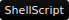

# Jack Jiang's Homepage

> Now is better than never. 
> Although never is often better than **right** now.
>  —— [The Zen of Python](https://www.python.org/dev/peps/pep-0020/)

## My Projects

 
/ 

### creatAbility 

A website which connects users, creators and sponsors of products for the disabled person. 

___

### Instacram

/

An Instagram-like single page web application.

___

### ColorFox

Jack's Browser Theme

___

### Reinforcement

A Deep Reinforcement Learning Project

___

### LeGit

An implementation of a subset of Git

___

### SCP

An implementation of a subset of TCP

___

### Junipy

/

An national indicator parse and analyse service

___

### SophieFans

A SVM binary classifier of newspaper paragraphs

___

### pagerank

)

A implementation of [pagerank](https://github.com/Jiangyiqun/COMP9024_C/tree/master/ass2/submit) using C and [auto-test script](https://github.com/Jiangyiqun/COMP9024_C/tree/master/ass2/autotest)

___

### Drone Simulation

A drone simulation program using AVR assembly language

___

### Sudoku

A python program which can solve sudoku and output as pdf

___

## Credit

- Hosted by [Github Pages](https://pages.github.com/)
- Theme by [Time Machine](https://github.com/pages-themes/time-machine)
- Badges by [Shields IO](https://shields.io/)